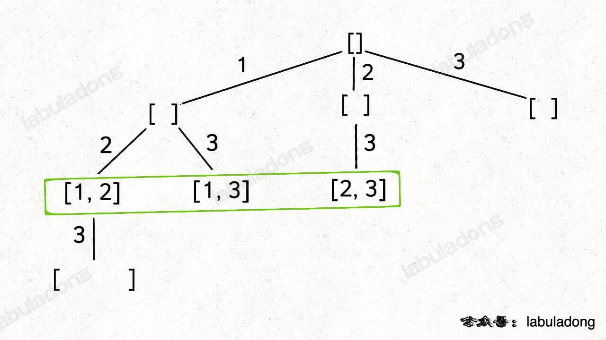
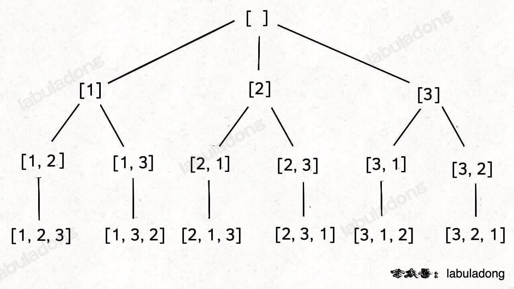

<!-- 回溯算法解题套路框架 -->
# 回溯算法是在遍历「树枝」，DFS 算法是在遍历「节点」
## 抽象地说，解决一个回溯问题，实际上就是遍历一棵决策树的过程，树的每个叶子节点存放着一个合法答案。你把整棵树遍历一遍，把叶子节点上的答案都收集起来，就能得到所有的合法答案。
站在回溯树的一个节点上，你只需要思考 3 个问题：

1、路径：也就是已经做出的选择。

2、选择列表：也就是你当前可以做的选择。

3、结束条件：也就是到达决策树底层，无法再做选择的条件。

### 组合/子集树
1,
2,
3,
12,
13,23,123


### 排列树
1,2,3
1,3,2
2,1,3
2,3,1
3,1,2
3,2,1 

                                                O(根节点)
                                                 /  |  \
                                                /   |   \
                                               /    |    \
                                              /     |     \
                                             /      |      \
                                            /       |       \
                                           /        |        \
                                          /         |         \
                                         /          |          \
                                        /           |           \
                                    1  /          2 |            \ 3
                                      /             |             \
                                     O              O              O
                                    / \            / \            / \
                                 2 /   \ 3      1 /   \ 3      1 /   \ 2
                                  /     \        /     \        /     \
                                 O       O      O       O      O       O
                                 |       |      |       |      |       |
                               3 |       | 2   3|       |1    2|       |1
                                 |       |      |       |      |       |
                                 O       O      O       O      O       O
### 回溯算法解题步骤
1、定义路径，定义选择列表，定义结束条件
2、编写回溯函数，在函数中编写选择列表，选择列表中做选择，递归调用回溯函数，撤销选择

### 回溯算法解题套路框架
```python
result = []
def backtrack(路径, 选择列表):
    if 满足结束条件:
        result.add(路径)
        return
    
    for 选择 in 选择列表:
        做选择
        backtrack(路径, 选择列表)
        撤销选择
```

# 总结
### 回溯算法就是个多叉树的遍历问题，关键是在前序和后序遍历的位置做一些操作.

## 子集（元素无重不可复选）

### 注意这棵树的特性：
### 如果把根节点作为第 0 层，将每个节点和根节点之间树枝上的元素作为该节点的值，那么第 n 层的所有节点就是大小为 n 的所有子集。

class Solution {
public:
  vector<vector<int>> subsets(vector<int>& nums) {
    backtrack(nums, 0);
    return res;
  }

  void backtrack(vector<int>& nums, int start) {
    res.push_back(track);
    for (int i = start; i < nums.size(); i++) {
      track.push_back(nums[i]);
      // 通过 start 参数控制树枝的遍历，避免产生重复的子集
      backtrack(nums, i + 1);
      track.pop_back();
    }
  }

private:
  vector<vector<int>> res;
  vector<int> track;
};

## 组合（元素无重不可复选）

class Solution {
public:
    vector<vector<int>> res;
    // 记录回溯算法的递归路径
    vector<int> track;

    // 主函数
    vector<vector<int>> combine(int n, int k) {
        backtrack(1, n, k);
        return res;
    }

    void backtrack(int start, int n, int k) {
        // base case
        if (k == track.size()) {
            // 遍历到了第 k 层，收集当前节点的值
            res.push_back(track);
            return;
        }

        // 回溯算法标准框架
        for (int i = start; i <= n; i++) {
            // 选择
            track.push_back(i);
            // 通过 start 参数控制树枝的遍历，避免产生重复的子集
            backtrack(i + 1, n, k);
            // 撤销选择
            track.pop_back();
        }
    }
};

## 排列 （元素无重不可复选）
排列问题本身就是让你穷举元素的位置,需要额外使用 used 数组来标记哪些元素还可以被选择
参考全排列permute.cc

## 子集/组合（元素可重不可复选）///子集 II

class Solution {
public:
    vector<vector<int>> subsetsWithDup(vector<int>& nums) {
        sort(nums.begin(), nums.end()); //排序，让相同的元素靠在一起
        backtrack(nums, 0);
        return res;
    }

    void backtrack(vector<int>& nums, int start) { // start 为当前的枚举位置
        res.push_back(sets); // 前序位置，每个节点的值都是一个子集

        for (int i = start; i < nums.size(); i++) {
            if (i > start && nums[i] == nums[i -1 ]) { // 剪枝逻辑，值相同的相邻树枝，只遍历第一条
                continue;
            }
            sets.push_back(nums[i]);
            backtrack(nums, i + 1);
            sets.pop_back();
        }
    }

private:
    vector<vector<int>> res;
    vector<int> sets;
};

## 组合总和 II（元素可重不可复选）

class Solution {
public:
    vector<vector<int>> combinationSum2(vector<int>& candidates, int target) {
        sort(candidates.begin(), candidates.end());
        backtrack(candidates, target, 0);
        return res;
    }

    void backtrack(vector<int>& candidates, int target, int start) {
        if (sum == target) {
            res.push_back(track);
            return;
        }
        if (sum > target) return;
        for (int i = start; i < candidates.size(); i++) {
            if (i > start && candidates[i] == candidates[i-1]) {
                continue;
            }
            track.push_back(candidates[i]);
            sum += candidates[i];
            backtrack(candidates, target, i + 1);
            track.pop_back();
            sum -= candidates[i];
        }
    }
private:
    vector<vector<int>> res;
    vector<int> track;
    int sum = 0;
};

## 排列（元素可重不可复选） 全排列II
### 标准的全排列算法利用 used 数组进行剪枝,避免重复使用同一个元素

class Solution {
public:
    vector<vector<int>> res;
    vector<int> track;

    vector<vector<int>> permuteUnique(vector<int>& nums) {
        vector<bool> used(nums.size(), false);
        sort(nums.begin(), nums.end());
        backtrack(nums, used);
        return res;
    }

    void backtrack(vector<int>& nums, vector<bool>& used) {
        if (track.size() == nums.size()) {
            res.push_back(track);
            return;
        }

        for (int i = 0; i < nums.size(); i++) { //遍历所有树枝
            if (used[i]) continue;
            
            if (i > 0 && nums[i] == nums[i - 1] && !used[i - 1]) continue;

            track.push_back(nums[i]);
            used[i] = true;
            backtrack(nums, used);
            track.pop_back();
            used[i] = false;
        }

    }
};

## 子集/组合（元素无重可复选）

class Solution {
public:
    vector<vector<int>> res;
    vector<int> track;
    int trackSum = 0;

    vector<vector<int>> combinationSum(vector<int>& candidates, int target) {
        backtrack(candidates,target, 0);
        return res;    
    }

    void backtrack(vector<int>& candidates, int target, int start) {
        if (trackSum == target) {
            res.push_back(track);
            return;
        }
        if (trackSum > target) return;

        for (int i = start; i < candidates.size(); i++) {
            
            track.push_back(candidates[i]);
            trackSum += candidates[i];

            backtrack(candidates, target, i);
            
            track.pop_back();
            trackSum -= candidates[i];
        }
    }
};

## 排列（元素无重可复选）
### 既然元素可以重复， 对于：全排列： 去掉：used：标记即可


# 总结

## 元素无重不可复选，即 nums 中的元素唯一，每个元素最多被使用一次，backtrack 核心代码如下：

/* 组合/子集问题回溯算法框架 */

void backtrack(vector<int>& nums, int start) {
    for (int i = start; i < nums.size(); i++>) {
        track.push_back(nums[i]);
        backtrack(nums, i + 1);
        track.pop_back();
    }
}

/* 排列问题回溯算法框架 */

void backtrack(vector<int>& nums) {
    for (int i = 0; i < nums.size(); i++) {
        // 剪枝逻辑
        if (used[i]) {
            continue;
        }
        // 做选择
        used[i] = true;
        track.push_back(nums[i]);
        backtrack(nums);
        // 撤销选择
        track.pop_back();
        used[i] = false;
    }
}

# 元素可重不可复选，即 nums 中的元素可以存在重复元素，每个元素只能被使用一次，其关键在于 排序 和 剪枝， backtrack 核心代码如下：

sort(nums.begin(), nums.end())；

/* 组合/子集问题回溯算法框架 */

void backtrack(vector<int>& nums, int start) {
    for (int i = start; i < nums.size(); i++) {
        // 剪枝逻辑，跳过值相同的相邻树枝
        if (i > start && nums[i] == nums[i - 1]) {
            continue;
        }
        // 做选择
        track.push_back(nums[i]);
        // 进入下一层决策树
        backtrack(nums, i + 1);
        // 取消选择
        track.pop_back();
    }
}

/* 排列问题回溯算法框架 */

void backtrack(vector<int>& nums, vector<bool>& used) {
    for (int i = 0; i < nums.size(); i++) {
        // 剪枝逻辑
        if (used[i]) {
            continue;
        }
        // 剪枝逻辑，固定相同的元素在排列中的相对位置
        if (i > 0 && nums[i] == nums[i - 1] && !used[i - 1]) {
            continue;
        }
        // 做选择
        used[i] = true;
        track.push_back(nums[i]);

        backtrack(nums, used);
        // 撤销选择
        track.pop_back();
        used[i] = false;
    }
}

# 元素无重可复选，即 nums 中元素都是唯一的， 每个元素可以被使用若干次

/* 组合/子集问题回溯算法框架 */

void backtrack(vector<int>& nums, int start, deque<int>& track) {
    // 回溯算法标准框架
    for (int i = start; i < nums.size(); i++) {
        // 做选择
        track.push_back(nums[i]);
        // 注意参数
        backtrack(nums, i, track);// i+1 改为i，因为元素可重复使用
        // 撤销选择
        track.pop_back();
    }
}

/* 排列问题回溯算法框架 */

void backtrack(vector<int>& nums, deque<int>& track) {
    for (int i = 0; i < nums.size(); i++) {
        // 做选择
        track.push_back(nums[i]);
        backtrack(nums, track);
        // 撤销选择
        track.pop_back();
    }
}


# 以球的视角理解子集问题的解法

class Solution {
private:

vector<vector<int>> res; 
vector<int> track; 

public:

vector<vector<int>> subsets(vector<int>& nums) {
    backtrack(nums, 0);
    return res;
}

// 回溯算法核心函数，遍历子集问题的回溯树
void backtrack(vector<int>& nums, int i) {
    if (i == nums.size())  
    {
        res.push_back(track);
        return;
    }
    
    // 做选择
    track.push_back(nums[i]);
    backtrack(nums, i + 1);
    track.pop_back();
    
    // 不做选择
    backtrack(nums, i + 1);
}
};